# 进程概述

## 说明

本部分笔记及源码出自`slide/02Linux多进程开发/01 进程概述`

## 程序和进程

- `程序`是包含一系列**信息**的文件，这些信息描述了如何在运行时创建一个`进程`
  - **二进制格式标识**：每个程序文件都包含用于描述可执行文件格式的元信息。内核利用此信息来解释文件中的其他信息，Linux中为ELF可执行连接格式
  - **机器语言指令**：对程序算法进行编码
  - **程序入口地址**：标识程序开始执行时的起始指令位置
  - **数据**：程序文件包含的变量初始值和程序使用的字面量值（比如字符串）
  - **符号表及重定位表**：描述程序中函数和变量的位置及名称。这些表格有多重用途，其中包括调试和运行时的符号解析（动态链接）
  - **共享库和动态链接信息**：程序文件所包含的一些字段，列出了程序运行时需要使用的共享库，以及加载共享库的动态连接器的路径名
  - 其他信息：程序文件还包含许多其他信息，用以描述如何创建进程
- **`进程`是正在运行的`程序`的实例**。是一个具有一定独立功能的程序关于某个数据集合的一次运行活动。它是操作系统动态执行的基本单元，在传统的操作系统中，进程既是基本的分配单元，也是基本的执行单元
- 可以用**一个程序来创建多个进程**，进程是由内核定义的抽象实体，并为该实体分配用以执行程序的各项系统资源。从内核的角度看，进程由用户内存空间和一系列内核数据结构组成，其中用户内存空间包含了程序代码及代码所使用的变量，而内核数据结构则用于维护进程状态信息。记录在内核数据结构中的信息包括许多与进程相关的标识号（IDs）、虚拟内存表、打开文件的描述符表、信号传递及处理的有关信息、进程资源使用及限制、当前工作目录和大量的其他信息

## 单道、多道程序设计

- `单道程序`，即在计算机内存中只允许一个的程序运行
- `多道程序`设计技术是在计算机内存中同时存放几道相互独立的程序，使它们**在管理程序控制下，相互穿插运行**，两个或两个以上程序在计算机系统中同处于开始到结束之间的状态，这些程序共享计算机系统资源。**引入多道程序设计技术的根本目的是为了提高 CPU 的利用率**
- 对于一个**单 CPU 系统**来说，程序同时处于运行状态只是一种宏观上的概念，他们虽然都已经开始运行，但**就微观而言，任意时刻，CPU 上运行的程序只有一个**
- 在多道程序设计模型中，多个进程轮流使用 CPU。而当下常见 **CPU 为纳秒级**，1秒可以执行大约 10 亿条指令。由于**人眼的反应速度是毫秒级**，所以看似同时在运行

## 时间片

- `时间片（timeslice）`又称为`量子（quantum）`或`处理器片（processor slice）`是操作系统分配给每个正在运行的进程微观上的一段 CPU 时间。事实上，虽然一台计算机通常可能有多个 CPU，但是同一个 CPU 永远不可能真正地同时运行多个任务。在只考虑一个 CPU 的情况下，这些进程“看起来像”同时运行的，实则是轮番穿插地运行，由于时间片通常很短（在 Linux 上为 `5ms－800ms`），用户不会感觉到
- **时间片由操作系统内核的调度程序分配给每个进程**。首先，内核会给每个进程分配相等的初始时间片，然后每个进程轮番地执行相应的时间，当所有进程都处于时间片耗尽的状态时，内核会重新为每个进程计算并分配时间片，如此往复

## 并行和并发

- `并行(parallel)`：指在同一时刻，有多条指令在多个处理器上同时执行
- `并发(concurrency)`：指在同一时刻只能有一条指令执行，但多个进程指令被快速的轮换执行，使得在宏观上具有多个进程同时执行的效果，但在微观上并不是同时执行的，只是把时间分成若干段，使多个进程快速交替的执行


## 进程控制块（PCB） 

- 为了管理进程，内核必须对每个进程所做的事情进行清楚的描述。内核为每个进程分配一个`PCB(Processing Control Block)进程控制块`，维护进程相关的信息，Linux 内核的进程控制块是 `task_struct` 结构体

- 在 `/usr/src/linux-headers-xxx/include/linux/sched.h` 文件中可以查看 `struct task_struct` 结构体定义，其中`linux-headers-xxx`需要替换为该目录下相应的版本

- 需要掌握的`struct task_struct` 结构体成员

  - **进程id**：系统中每个进程有唯一的 id，用 `pid_t` 类型表示，其实就是一个非负整数

  - **进程的状态**：有`就绪`、`运行`、`挂起`、`停止`等状态

  - 进程切换时需要**保存和恢复的一些CPU寄存器**

  - 描述**虚拟地址空间**的信息

  - 描述**控制终端**的信息

  - 当前工作目录（Current Working Directory） 

  - `umask 掩码`

  - 文件描述符表，包含很多指向 file 结构体的指针

  - 和信号相关的信息

  - 用户 id 和组 id

  - 会话（Session）和进程组

  - 进程可以使用的资源上限（Resource Limit），在Linux中可用`ulimit -a`查看资源上限

    

# 进程状态

## 说明

本部分笔记及源码出自`slide/02Linux多进程开发/02 进程状态及转换`

## 基本概念

- 进程状态反映进程执行过程的变化，这些状态随着进程的执行和外界条件的变化而转换
- 分为`三态模型`和`五态模型`

## 三态模型

- `运行态`：进程占有处理器正在运行
- `就绪态`：进程具备运行条件，等待系统分配处理器以便运行。当进程已分配到除CPU以外的所有必要资源后，只要再获得CPU，便可立即执行。在一个系统中处于就绪状态的进程可能有多个，通常将它们排成一个队列，称为就绪队列
- `阻塞态`：又称为等待(wait)态或睡眠(sleep)态，指进程不具备运行条件，正在等待某个事件的完成

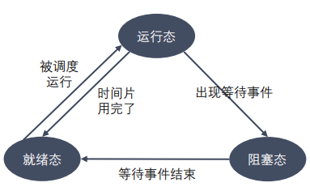

## 五态模型

- 除`新建态`和`终止态`，其余三个状态与`三态模型`一致
- `新建态`：进程刚被创建时的状态，尚未进入就绪队列
- `终止态`：进程完成任务到达正常结束点，或出现无法克服的错误而异常终止，或被操作系统及有终止权的进程所终止时所处的状态。进入终止态的进程以后不再执行，但依然保留在操作系统中等待善后。一旦其他进程完成了对终止态进程的信息抽取之后，操作系统将删除该进程


## 进程相关命令

### 查看进程—静态

- `ps`命令用来查看进程（静态），可以使用`man ps`查看使用说明

  

- 常用参数含义

  - a：显示终端上的所有进程，包括其他用户的进程
  - u：显示进程的详细信息
  - x：显示没有控制终端的进程
  - j：列出与作业控制相关的信息

- `ps -aux`或`ps aux`

  

  - `USER`：进程所属用户

  - `PID`：进程ID

  - `%CPU`：CPU使用占比

  - `%MEM`：内存使用占比

  - `TTY`：进程所属终端，在终端直接执行`tty`可查看当前`Terminal`所属终端（因为此时我还打开了另外两个终端）

    

  - `STAT`：进程状态

    - D ：不可中断 Uninterruptible（usually IO）
    - R：正在运行，或在队列中的进程
    - S(大写) ：处于休眠状态
    - T：停止或被追踪
    - Z：僵尸进程
    - W：进入内存交换（从内核2.6开始无效）
    - X：死掉的进程
    - <：高优先级
    - N：低优先级
    - s：包含子进程
    - \+：位于前台的进程组

  - `START`：进程开始执行时间

  - `TIME`：进程执行持续时间

  - `COMMAND`：进程执行命令

- `ps -ajx`或`ps ajx`

  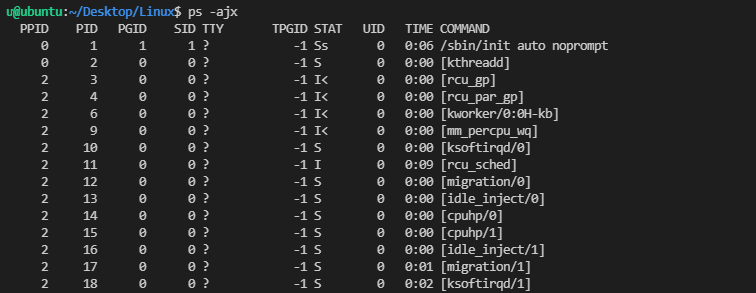

  - `PPID`：该进程的父进程ID
  - `PGID`：该进程所属组ID
  - `SID`：该进程所属会话(session)ID，多个组构成会话

### 查看进程-动态

- `top`

  

- 可以在使用 top 命令时加上 -d 来指定显示信息更新的时间间隔

- 在 top 命令执行后，可以按以下按键对显示的结果进行排序

  - M：根据内存使用量排序
  - P：根据 CPU 占有率排序
  - T：根据进程运行时间长短排序
  - U：根据用户名来筛选进程
  - K：输入指定的 PID 杀死进程

### 杀死进程

- `kill [-signal] pid`

- `kill -l`：列出所有信号

  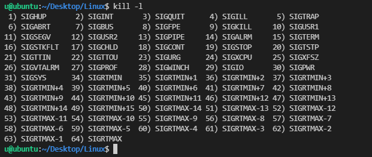

- `kill -9 进程ID`等价于`kill –SIGKILL 进程ID`

  

- `killall name`：根据进程名杀死进程

##  进程号和相关函数

- 每个进程都由进程号来标识，其类型为 `pid_t（整型）`，进程号的范围：`0～32767`。进程号总是唯一的，但可以重用。当一个进程终止后，其进程号就可以再次使用
- **任何进程（除 init 进程）都是由另一个进程创建**，该进程称为被创建进程的父进程，对应的进程号称为父进程号（PPID）
- **进程组是一个或多个进程的集合**。他们之间相互关联，进程组可以接收同一终端的各种信号，关联的进程有一个进程组号（PGID）。默认情况下，当前的进程号会当做当前的进程组号
- 进程号和进程组相关函数
  - `pid_t getpid(void);`：获取进程ID
  - `pid_t getppid(void);`：获取进程的父进程ID
  - `pid_t getpgid(pid_t pid);`：获取进程的组ID

# 进程创建

## 说明

本部分笔记及源码出自`slide/02Linux多进程开发/03 进程创建`

## 进程创建：fork

- `pid_t fork(void);`

  ```c
  /*
      #include <sys/types.h>
      #include <unistd.h>
  
      pid_t fork(void);
          函数的作用：用于创建子进程。
          返回值：
              fork()的返回值会返回两次。一次是在父进程中，一次是在子进程中。
              在父进程中返回创建的子进程的ID,
              在子进程中返回0
              如何区分父进程和子进程：通过fork的返回值。
              在父进程中返回-1，表示创建子进程失败，并且设置errno
  */
  
  #include <sys/types.h>
  #include <unistd.h>
  #include <stdio.h>
  
  int main() 
  {
      int num = 10;
  
      // 创建子进程
      pid_t pid = fork();
  
      // 判断是父进程还是子进程
      if(pid > 0) {
          printf("pid : %d\n", pid);
          // 如果大于0，返回的是创建的子进程的进程号，当前是父进程
          printf("i am parent process, pid : %d, ppid : %d\n", getpid(), getppid());
  
          printf("parent num : %d\n", num);
          num += 10;
          printf("parent num += 10 : %d\n", num);
      } else if(pid == 0) {
          // 当前是子进程
          printf("i am child process, pid : %d, ppid : %d\n", getpid(),getppid());
         
          printf("child num : %d\n", num);
          num += 100;
          printf("child num += 100 : %d\n", num);
      }
  
      // for循环
      for(int i = 0; i < 3; i++) {
          printf("i : %d , pid : %d\n", i , getpid());
          sleep(1);
      }
  
      return 0;
  }
  ```

  

## fork工作原理

- Linux 的 `fork()` 使用是通过**写时拷贝 (copy- on-write) 实现**。写时拷贝是一种可以推迟甚至避免拷贝数据的技术

- 内核此时并不复制整个进程的地址空间，而是让**父子进程共享同一个地址空间**，只有在**需要写入的时候**才会复制地址空间，从而使各个进程拥有各自的地址空间。即**资源的复制是在需要写入的时候才会进行，在此之前，只有以只读方式共享**（示例程序中`num`的作用）

- **fork之后父子进程共享文件**。fork产生的子进程与父进程**有相同的文件描述符，指向相同的文件表**，引用计数增加，共享文件偏移指针

- 使用**虚拟地址空间**，由于用的是**写时拷贝 (copy- on-write) **，下图**不完全准确，但可帮助理解**

  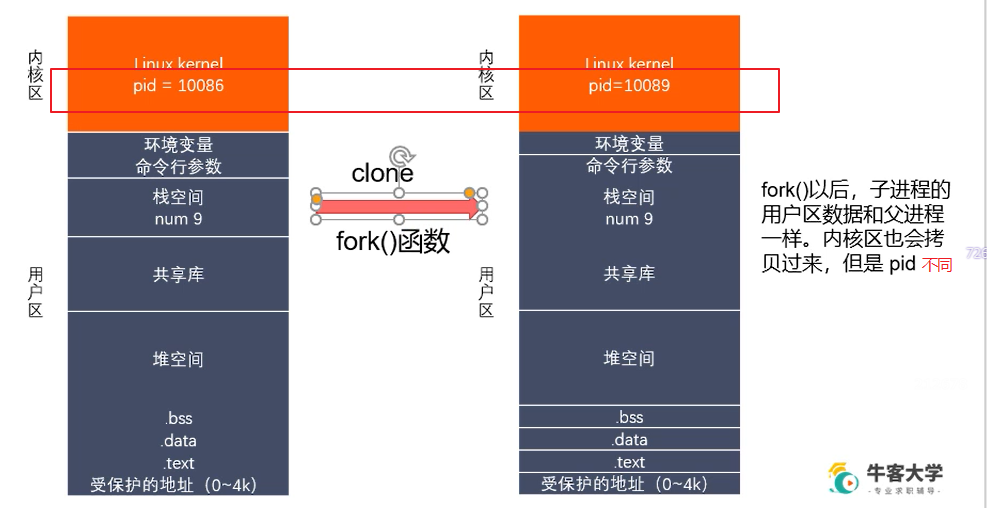

## 父子进程关系

### 区别

- **fork()函数的返回值不同**。父进程中: >0 返回的是子进程的ID，子进程中: =0
- **pcb中的一些数据不同**。pcb中存的是**当前进程的ID(pid)**，**当前进程的父ID(ppid)**和**信号集**

### 共同点

- 在某些状态下，即**子进程刚被创建出来，还没有执行任何的写数据的操作**。此时**用户区的数据**和**文件描述符表**父进程和子进程一样

### 父子进程对变量共享说明

- 刚开始的时候，是一样的，共享的。如果修改了数据，不共享了
- 读时共享（子进程被创建，两个进程没有做任何的写的操作），写时拷贝

## GDB 多进程调试

- 在以下调试程序**第10行**及**第20行**打断点，后续说明都基于这两个断点

  

- 打断点及查看

  

- 使用 GDB 调试的时候，GDB 默认只能跟踪一个进程，可以在 fork 函数调用之前，通过指令设置 GDB 调试工具跟踪父进程或者是跟踪子进程，**默认跟踪父进程**

- 查看当前跟踪的进程：`show follow-fork-mode`

  

- 设置调试父进程或者子进程：`set follow-fork-mode [parent（默认）| child]`

  

  - 调试父进程，子进程循环会自动执行，完毕后需要输入`n`继续执行父进程

    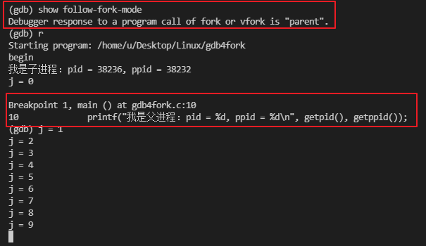

  - 调试子进程，父进程循环会自动执行，完毕后需要输入`n`继续执行子进程

    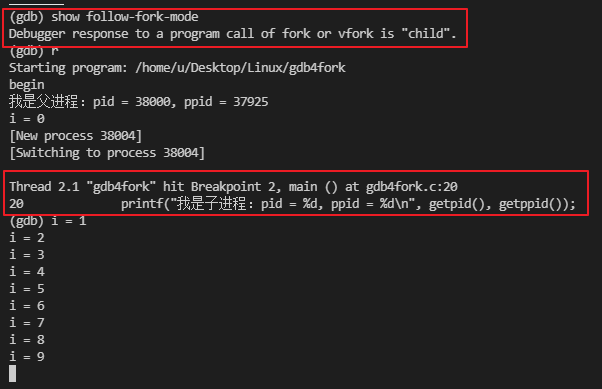

- 查看调试模式：`show detach-on-fork`

  

- 设置调试模式：`set detach-on-fork [on | off]`

  - 默认为 on，表示调试当前进程的时候，其它的进程继续运行，如果为 off，调试当前进

    程的时候，其它进程被 GDB 挂起

  - 注：在设置为`off`时，执行程序会报以下错误，原因是**gdb 8.x版本存在bug**

    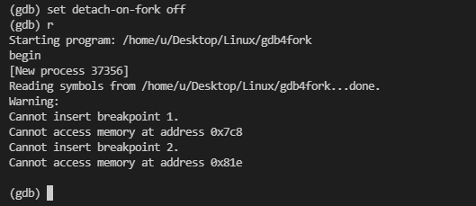

  - 以下正常执行的`gdb`版本为`v7.11.1`（截图来源于视频），与设置为`on`的区别在于，**`for`循环是否打印**

    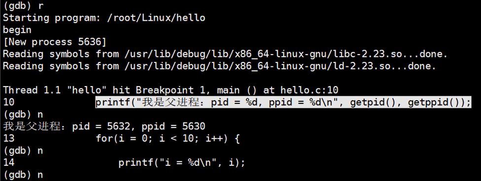

- 查看调试的进程：`info inferiors`，此时调试进程为`parent`，需要执行后才会显示进程

  - 当`detach-on-fork`为`on`时，只会显示一个进程（==因为另一个进程已经执行完毕，销毁==，猜测）

    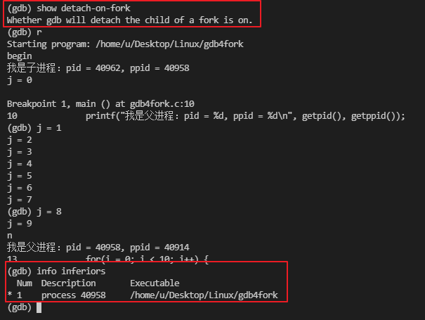

  - 当`detach-on-fork`为`off`时，会显示两个进程

    

- 切换当前调试的进程：`inferior Num`

- 使进程脱离 GDB 调试：`detach inferiors Num`

# exec函数族

## 说明

本部分笔记及源码出自`slide/02Linux多进程开发/04 exec函数族`

## 基本概念

- `exec 函数族`的作用是根据指定的文件名找到可执行文件，并用它来取代调用进程的内容，换句话说，就是**在调用进程内部执行一个可执行文件**
- exec 函数族的函数执行成功后不会返回，因为调用进程的实体，包括代码段，数据段和堆栈等都已经被新的内容取代，只留下进程 ID 等一些表面上的信息仍保持原样，颇有些神似“三十六计”中的“金蝉脱壳”。看上去还是旧的躯壳，却已经注入了新的灵魂。只有调用失败了，它们才会返回 -1，从原程序的调用点接着往下执行

- 用户区替换为`a.out`的内容，内核区不变

  

## 种类

- 基本组件为`exec`，后面跟不同参数，代表不同含义

  - `l(list) `：参数地址列表，以**空指针结尾**

  - `v(vector) `：存有各参数地址的指针数组的地址

  - `p(path) `：按 PATH 环境变量指定的目录搜索可执行文件，可用`env`查看现有的环境变量

    

  - `e(environment)`：存有环境变量字符串地址的指针数组的地址，增加新的环境变量

- `exec`函数族属于C语言标准库函数，可使用`man 3 exec`查看说明

  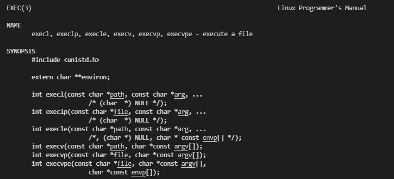

- 说明：下列示例程序除核心代码外，保持一致，初始包含文件有

  

- `int execl(const char *path, const char *arg, .../* (char *) NULL */);`

  - `path`：需要指定的执行的文件的路径或者名称

  - `arg`：是执行可执行文件所需要的参数列表。第一个参数一般没有什么作用，为了方便，一般写的是执行的程序的名称，从第二个参数开始往后，就是程序执行所需要的的参数列表，参数最后需要以NULL结束（哨兵）

  - code

    ```c
    #include <unistd.h>
    #include <stdio.h>
    
    int main() {
    
    
        // 创建一个子进程，在子进程中执行exec函数族中的函数
        pid_t pid = fork();
    
        if(pid > 0) {
            // 父进程
            printf("i am parent process, pid : %d\n",getpid());
            // 如果不加这句，会存在孤儿进程，输出异常
            sleep(1);
        }else if(pid == 0) {
            // 子进程
            // 调用自己写的可执行程序
            execl("/home/u/Desktop/Linux/hello","hello",NULL);
    
            // 调用系统进程
            // execl("/bin/ps", "ps", "aux", NULL);
            perror("execl");
            printf("i am child process, pid : %d\n", getpid());
    
        }
    
        for(int i = 0; i < 3; i++) {
            printf("i = %d, pid = %d\n", i, getpid());
        }
    
    
        return 0;
    }
    ```

  - output

    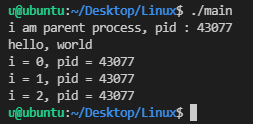

  - 说明：可以看到，子进程的内容（用户区）被替换，打印的是`hello`中的内容

- `int execlp(const char *file, const char *arg, ... /* (char *) NULL */);`

  - 会到环境变量中查找指定的可执行文件，如果找到了就执行，找不到就执行不成功

  - `file`：只需要提供名称（不需要提供路径）

  - code

    ```c
    #include <unistd.h>
    #include <stdio.h>
    
    int main() {
    
    
        // 创建一个子进程，在子进程中执行exec函数族中的函数
        pid_t pid = fork();
    
        if(pid > 0) {
            // 父进程
            printf("i am parent process, pid : %d\n",getpid());
            sleep(1);
        }else if(pid == 0) {
            // 子进程
            execlp("ps", "ps", "aux", NULL);
    
            printf("i am child process, pid : %d\n", getpid());
    
        }
    
        for(int i = 0; i < 3; i++) {
            printf("i = %d, pid = %d\n", i, getpid());
        }
    
    
        return 0;
    }
    ```

  - output

    

- `int execle(const char *path, const char *arg, .../*, (char *) NULL, char * const envp[] */);`

  - `envp`：添加路径至环境变量，注意以`NULL`结尾，否则报`execle: Bad address`

  - code

    ```c
    #include <unistd.h>
    #include <stdio.h>
    
    int main() {
    
    
        // 创建一个子进程，在子进程中执行exec函数族中的函数
        pid_t pid = fork();
    
        if(pid > 0) {
            // 父进程
            printf("i am parent process, pid : %d\n",getpid());
            sleep(1);
        }else if(pid == 0) {
            // 子进程
            // 需要已NULL结尾，否则报 execle: Bad address 错误
            char* envp[] = {"/home/u/Desktop/Linux/", NULL};
            execle("/home/u/Desktop/Linux/hello", "hello", NULL, envp);
            perror("execle");
            printf("i am child process, pid : %d\n", getpid());
    
        }
    
        for(int i = 0; i < 3; i++) {
            printf("i = %d, pid = %d\n", i, getpid());
        }
    
    
        return 0;
    }
    ```

  - output

    

- `int execv(const char *path, char *const argv[]);`

  - `argv`：将运行参数都写在数组中

  - code

    ```c
    #include <unistd.h>
    #include <stdio.h>
    
    int main() {
    
    
        // 创建一个子进程，在子进程中执行exec函数族中的函数
        pid_t pid = fork();
    
        if(pid > 0) {
            // 父进程
            printf("i am parent process, pid : %d\n",getpid());
            sleep(1);
        }else if(pid == 0) {
            // 子进程
            char* argv[] = {"hello", NULL};
            execv("/home/u/Desktop/Linux/hello", argv);
            perror("execv");
            printf("i am child process, pid : %d\n", getpid());
    
        }
    
        for(int i = 0; i < 3; i++) {
            printf("i = %d, pid = %d\n", i, getpid());
        }
    
    
        return 0;
    }
    ```

  - output

    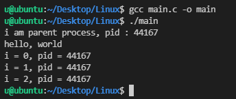

- ` int execvp(const char *file, char *const argv[]);`

- `int execvpe(const char *file, char *const argv[], char *const envp[]);`

- `int execve(const char *filename, char *const argv[], char *const envp[]);`

