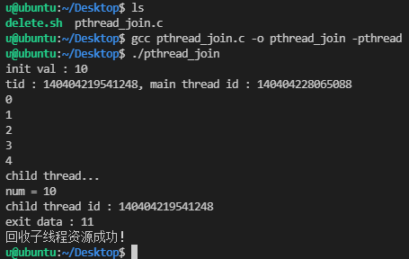
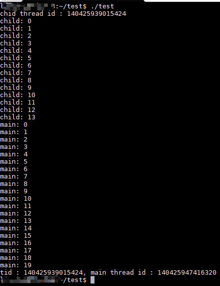
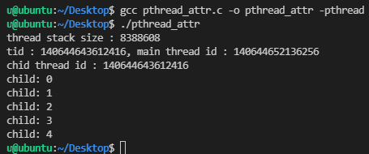

# 线程基础

## 说明

本部分笔记及源码出自`slide/03Linux多线程开发/01 线程基础`

## 线程概述

### 基本概念

- 与`进程（process）`类似，`线程（thread）`是允许应用程序**并发执行多个任务**的一种机制
- 一个进程可以包含多个线程
- 同一个程序中的所有线程均会独立执行相同程序，且共享同一份全局内存区域，其中包括初始化数据段、未初始化数据段，以及堆内存段。（传统意义上的 UNIX 进程只是多线程程序的一个特例，该进程只包含一个线程）
- **进程是 CPU 分配资源的最小单位，线程是操作系统调度执行的最小单位**
- 线程是轻量级的进程（`LWP：Light Weight Process`），在 Linux 环境下线程的本质仍是进程
- 查看指定进程的 `LWP` 号：`ps –Lf pid`，其中`pid`可以由`ps aux`得到
- 一般情况下，`main函数`所在的线程我们称之为`主线程（main线程）`，其余创建的线程称为`子线程`
  - 程序中默认只有一个进程，`fork()`函数调用，2进程（父子进程）
  - 程序中默认只有一个线程，`pthread_create()`函数调用，2个线程（主线程和子线程）

### 线程和进程区别

- **进程间的信息难以共享**。由于除去只读代码段外，父子进程并未共享内存，因此必须采用一些进程间通信方式，在进程间进行信息交换
- 调用 `fork()` 来创建进程的代价相对较高，即便利用写时复制技术，仍然需要复制诸如内存页表和文件描述符表之类的多种进程属性，这意味着 `fork()` 调用在时间上的开销依然不菲
- 线程之间能够方便、快速地共享信息。只需**将数据复制到共享（全局或堆）变量**中即可
- 创建线程比创建进程通常要快 10 倍甚至更多。线程间是共享虚拟地址空间的，无需采用写时复制来复制内存，也无需复制页表

### 线程之间共享和非共享资源

#### 共享资源

- 进程 ID 和父进程 ID
- 进程组 ID 和会话 ID
- 用户 ID 和 用户组 ID
- 文件描述符表
- 信号处置
- 文件系统的相关信息：文件权限掩码（`umask`）、当前工作目录
- 虚拟地址空间（**除栈、.text**）

#### 非共享资源

- 线程 ID
- 信号掩码
- 线程特有数据
- error 变量
- 实时调度策略和优先级
- 栈，本地变量和函数的调用链接信息

### NPTL

- 当 Linux 最初开发时，在内核中并不能真正支持线程。但是它的确可以通过 `clone()` 系统调用将进程作为可调度的实体。这个调用创建了调用进程（calling process）的一个拷贝，这个拷贝与调用进程共享相同的地址空间。`LinuxThreads` 项目使用这个调用来完成在用户空间模拟对线程的支持。不幸的是，这种方法有一些缺点，尤其是在信号处理、调度和进程间同步等方面都存在问题。另外，这个线程模型也不符合 `POSIX` 的要求
- 要改进 `LinuxThreads`，需要内核的支持，并且重写线程库。有两个相互竞争的项目开始来满足这些要求
  - 一个包括 IBM 的开发人员的团队开展了 `NGPT（Next-Generation POSIX Threads）`项目
  - 同时，Red Hat 的一些开发人员开展了 `NPTL` 项目
  - `NGPT` 在 2003 年中期被放弃了，把这个领域完全留给了 `NPTL`

- `NPTL`，或称为 `Native POSIX Thread Library`，是 Linux 线程的一个新实现，它克服了 `LinuxThreads `的缺点，同时也符合 `POSIX` 的需求。与 `LinuxThreads` 相比，它在性能和稳定性方面都提供了重大的改进

- 查看当前 `pthread` 库版本：`getconf GNU_LIBPTHREAD_VERSION`

  

### 注意

- 由于`pthread`属于第三方库，所以在编译时需要加上参数`-pthread`或`-lpthread`即指定包路径，如果不加报以下错误（执行程序为线程创建）

  

## 线程操作函数

- 获取当前的线程的线程ID：`pthread_t pthread_self(void);`

- 比较两个线程ID是否相等：`int pthread_equal(pthread_t t1, pthread_t t2);`

  > 不同的操作系统，`pthread_t`类型的实现不一样，有的是无符号的长整型，有的是使用结构体去实现的

- 线程创建：``int pthread_create(pthread_t *thread, const pthread_attr_t *attr, void *(*start_routine) (void *), void *arg);``

- 线程终止：`void pthread_exit(void *retval);`

## 线程创建

- `int pthread_create(pthread_t *thread, const pthread_attr_t *attr, void *(*start_routine) (void *), void *arg);`
  - 通过`man 3 pthread_create`查看帮助
  - 功能：创建一个子线程
  - 参数
    - `thread`：传出参数，线程创建成功后，子线程的线程ID被写到该变量中
    - `attr` : 设置线程的属性，一般使用默认值，NULL
    - `start_routine` : 函数指针，这个函数是子线程需要处理的逻辑代码
    - `arg` : 给第三个参数(`start_routine`)使用，传参
  - 返回值
    - 成功：0
    - 失败：返回错误号。这个错误号和之前`errno`不太一样。获取错误号的信息：  `char * strerror(int errnum);`

```c
#include <stdio.h>
#include <pthread.h>
#include <string.h>
#include <unistd.h>

void* myWork(void* arg) {
    printf("child thread...\n");
    printf("num = %d\n", *(int*)arg);
    
    return NULL;
}

int main()
{
    // 创建子线程
    pthread_t tid;
    int num = 10;
    int ret = pthread_create(&tid, NULL, myWork, (void*)&num);
    if (ret != 0) {
        char * errstr = strerror(ret);
        printf("error : %s\n", errstr);
    }

    for (int i = 0; i < 5; i++) {
        printf("%d\n", i);
    }

    // 防止子线程没有抢占到CPU且此时主线程已经执行完并退出
    sleep(1);
    return 0;
}
```


## 线程终止

- `void pthread_exit(void *retval);`
  - 通过`man 3 pthread_exit`查看帮助
  - 功能：终止一个线程，在哪个线程中调用，就表示终止哪个线程
  - 参数：`retval`，需要传递一个指针，作为一个返回值，可以在`pthread_join()`中获取到

```c
#include <stdio.h>
#include <pthread.h>
#include <string.h>
#include <unistd.h>

void* myWork(void* arg) {
    printf("child thread...\n");
    printf("num = %d\n", *(int*)arg);
    printf("child thread id : %ld\n", pthread_self());

    return NULL;
}

int main()
{
    // 创建子线程
    pthread_t tid;
    int num = 10;
    int ret = pthread_create(&tid, NULL, myWork, (void*)&num);
    if (ret != 0) {
        char * errstr = strerror(ret);
        printf("error : %s\n", errstr);
    }
    printf("tid : %ld, main thread id : %ld\n", tid ,pthread_self());

    for (int i = 0; i < 5; i++) {
        printf("%d\n", i);
    }

    // 让主线程退出，当主线程退出时，不会影响其他正常运行的线程
    pthread_exit(NULL);
    // 下面程序已经不能被执行
    printf("test message\n");

    return 0;
}
```


## 线程连接

- `int pthread_join(pthread_t thread, void **retval);`
  - 通过`man 3 pthread_join`查看帮助
  - 功能：和一个已经终止的线程进行连接。回收子线程的资源，这个函数是阻塞函数，调用一次只能回收一个子线程，一般在主线程中使用
  - 参数
    - `thread`：需要回收的子线程的ID
    - `retval`：接收子线程退出时的返回值
  - 返回值
    - 成功：0
    - 失败：返回错误号。这个错误号和之前`errno`不太一样。获取错误号的信息：  `char * strerror(int errnum);`

```c
#include <stdio.h>
#include <pthread.h>
#include <string.h>
#include <unistd.h>

int val = 10;

void* myWork(void* arg) {
    printf("child thread...\n");
    printf("num = %d\n", *(int*)arg);
    printf("child thread id : %ld\n", pthread_self());
    val++;
    
    pthread_exit((void*)&val);     // 等价于return (void*)&val;
}

int main()
{
    printf("init val : %d\n", val);
    // 创建子线程
    pthread_t tid;
    int num = 10;
    int ret = pthread_create(&tid, NULL, myWork, (void*)&num);
    if (ret != 0) {
        char * errstr = strerror(ret);
        printf("error : %s\n", errstr);
    }
    printf("tid : %ld, main thread id : %ld\n", tid ,pthread_self());

    for (int i = 0; i < 5; i++) {
        printf("%d\n", i);
    }

    // 主线程调用pthread_join()回收子线程的资源
    int * thread_retval;
    ret = pthread_join(tid, (void **)&thread_retval);

    if(ret != 0) {
        char * errstr = strerror(ret);
        printf("error : %s\n", errstr);
    }
    printf("exit data : %d\n", *thread_retval);
    printf("回收子线程资源成功！\n");
    
    // 让主线程退出，当主线程退出时，不会影响其他正常运行的线程
    pthread_exit(NULL);
    // 下面程序已经不能被执行
    printf("test message\n");

    return 0;
}
```



## 线程分离

- `int pthread_detach(pthread_t thread);`
  - 通过`man 3 pthread_detach`查看帮助
  - 功能：分离一个线程。被分离的线程在终止的时候，会自动释放资源返回给系统
    - 不能多次分离，会产生不可预料的行为
    - 不能去连接一个已经分离的线程，会报错
  - 参数：需要分离的线程的ID
  - 返回值
    - 成功：0
    - 失败：返回错误号。这个错误号和之前`errno`不太一样。获取错误号的信息：  `char * strerror(int errnum);`

```c
#include <stdio.h>
#include <pthread.h>
#include <string.h>
#include <unistd.h>

void* myWork(void * arg) {
    printf("chid thread id : %ld\n", pthread_self());
    return NULL;
}

int main() 
{
    // 创建一个子线程
    pthread_t tid;
    int ret = pthread_create(&tid, NULL, myWork, NULL);
    if(ret != 0) {
        char * errstr = strerror(ret);
        printf("error1 : %s\n", errstr);
    }

    // 输出主线程和子线程的id
    printf("tid : %ld, main thread id : %ld\n", tid, pthread_self());

    // 设置子线程分离,子线程分离后，子线程结束时对应的资源就不需要主线程释放
    ret = pthread_detach(tid);
    if(ret != 0) {
        char * errstr = strerror(ret);
        printf("error2 : %s\n", errstr);
    }

    // 设置分离后，对分离的子线程进行连接 pthread_join()
    // ret = pthread_join(tid, NULL);
    // if(ret != 0) {
    //     char * errstr = strerror(ret);
    //     printf("error3 : %s\n", errstr);
    // }

    pthread_exit(NULL);

    return 0;
}
```


## 线程取消

- `int pthread_cancel(pthread_t thread);`
  - 通过`man 3 pthread_cancel`查看帮助
  - 功能：取消线程（让线程终止）。取消某个线程，可以终止某个线程的运行， 但是并不是立马终止，而是当子线程执行到一个**取消点**，线程才会终止
  - **取消点**：系统规定好的一些系统调用，我们可以粗略的理解为从用户区到内核区切换的位置，可以通过`man pthreads`查看取消点

```c
#include <stdio.h>
#include <pthread.h>
#include <string.h>
#include <unistd.h>

void* myWork(void * arg) {
    printf("chid thread id : %ld\n", pthread_self());
    for (int i = 0; i < 20; i++) {
        printf("child: %d\n", i);
    }
    return NULL;
}

int main() 
{
    // 创建一个子线程
    pthread_t tid;
    int ret = pthread_create(&tid, NULL, myWork, NULL);
    if(ret != 0) {
        char * errstr = strerror(ret);
        printf("error1 : %s\n", errstr);
    }
    
    // 线程取消
    pthread_cancel(tid);
    for (int i = 0; i < 20; i++) {
        printf("main: %d\n", i);
    }

    // 输出主线程和子线程的id
    printf("tid : %ld, main thread id : %ld\n", tid, pthread_self());

    pthread_exit(NULL);

    return 0;
}
```

- 以上代码在不同机器可能无法触发线程取消，每次执行结果也不一定相同=>==猜测由于速度过快==

  - 虚拟机

    

  - 实体机

    

## 线程属性

### 常用API

- 线程属性类型：`pthread_attr_t`
- 初始化线程属性变量：`int pthread_attr_init(pthread_attr_t *attr);`
- 释放线程属性的资源：`int pthread_attr_destroy(pthread_attr_t *attr);`
- 获取线程分离的状态属性：`int pthread_attr_getdetachstate(const pthread_attr_t *attr, int *detachstate);`
- 设置线程分离的状态属性：`int pthread_attr_setdetachstate(pthread_attr_t *attr, int detachstate);`

### 设置步骤

1. 创建一个线程属性变量
2. 初始化属性变量
3. 设置属性
4.  释放线程属性资源

### 实例：通过设置线程属性实现线程分离

```c
#include <stdio.h>
#include <pthread.h>
#include <string.h>
#include <unistd.h>

void* myWork(void * arg) {
    printf("chid thread id : %ld\n", pthread_self());
    for (int i = 0; i < 5; i++) {
        printf("child: %d\n", i);
    }
    return NULL;
}

int main() 
{
    // 1. 创建一个线程属性变量
    pthread_attr_t attr;
    // 2. 初始化属性变量
    pthread_attr_init(&attr);
    // 3. 设置属性-线程分离
    pthread_attr_setdetachstate(&attr, PTHREAD_CREATE_DETACHED);

    // 创建一个子线程
    pthread_t tid;
    int ret = pthread_create(&tid, NULL, myWork, NULL);
    if(ret != 0) {
        char * errstr = strerror(ret);
        printf("error1 : %s\n", errstr);
    }
    
    // 获取线程的栈的大小
    size_t size;
    pthread_attr_getstacksize(&attr, &size);
    printf("thread stack size : %ld\n", size);

    // 输出主线程和子线程的id
    printf("tid : %ld, main thread id : %ld\n", tid, pthread_self());
    // 4. 释放线程属性资源
    pthread_attr_destroy(&attr);

    pthread_exit(NULL);

    return 0;
}
```


