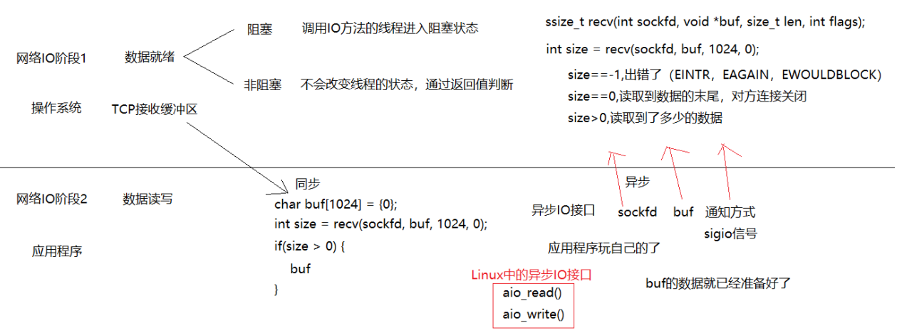

# 说明

本部分笔记及源码出自`slide/05项目实战`

# 阻塞/非阻塞 & 同步/异步

- 一个典型的网络IO接口调用，分为两个阶段，分别是`数据就绪` 和 `数据读写`

- `数据就绪阶段`分为`阻塞`和`非阻塞`

  - 阻塞：阻塞当前线程，直到满足条件
  - 非阻塞：直接返回，等满足条件时再通知

- `数据读写阶段`分为`同步`和`异步`

  - 同步：当A向B请求调用一个网络IO接口时(或者调用某个业务逻辑API接口时)，**数据的读写都是由请求方A自己来完成的(不管是阻塞还是非阻塞)**
  - 异步：A向B请求调用一个网络IO接口时(或者调用某个业务逻辑API接口时)，**向B传入请求的事件以及事件发生时通知的方式，A就可以处理其它逻辑了**，当B监听到事件处理完成后，会用事先约定好的通知方式，通知A处理结果

- 小结

  > 陈硕：在处理 IO 的时候，阻塞和非阻塞都是同步 IO，只有使用了特殊的 API 才是异步 IO

  

- 图示说明

  

  - `sockfd`对应操作系统中的TCP接收缓冲区
  - `recv`默认阻塞，直到读到数据才往下执行，如果设置为非阻塞，那么就应该通过返回值判断
    - `size == -1`：说明读取出错了，但有几种例外需要判断，如产生了`EINTR`(信号捕捉回收子进程资源时产生`SIGCHLD`导致这个信号)，`EAGAIN/EWOULDBLOCK`信号
    - `size == 0`：读到文件末尾，即对方连接已关闭
    - `size > 0`：读到了大小为`size`的数据

- 参考

  - [linux中对errno是EINTR的处理](https://blog.csdn.net/hnlyyk/article/details/51444617)
  - [Linux中的EAGAIN含义](https://www.cnblogs.com/pigerhan/archive/2013/02/27/2935403.html)